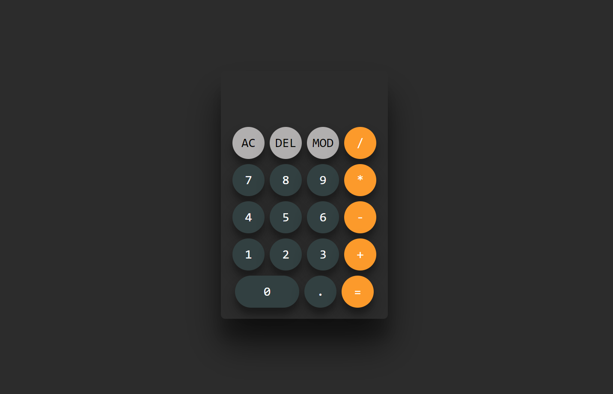

# Calculator Project

This is a simple calculator application built using HTML, CSS, and JavaScript. The calculator supports basic arithmetic operations and has a clean, modern user interface.



## Features

- **Basic Operations**: Addition, subtraction, multiplication, and division.
- **Additional Functions**: Clear (AC), delete (DEL), and modulo (MOD).
- **Responsive Design**: The calculator interface is designed to be responsive and looks good on different screen sizes.
- **Keyboard Support**: Users can also use their keyboard for input.

## Technologies Used

- **HTML**: For structuring the calculator layout.
- **CSS**: For styling the calculator and creating a visually appealing interface.
- **JavaScript**: For implementing the calculator logic and handling user interactions.

## Installation

To use this calculator, simply clone the repository and open the `index.html` file in your web browser.

```bash
git clone https://github.com/sumanbiswas9/Calculator-Using-HTML-CSS-and-JAVASCRIPT.git
cd Calculator-Using-HTML-CSS-and-JAVASCRIPT
open index.html
